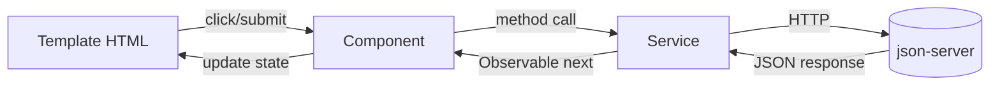
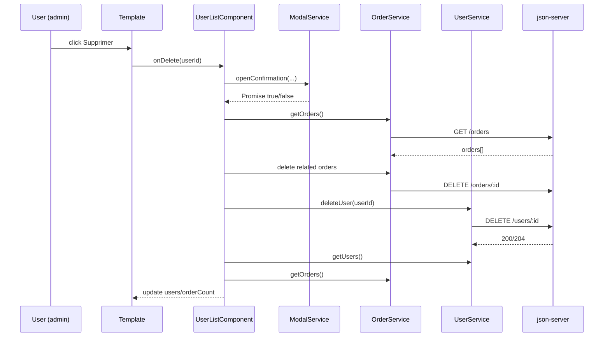

# Analyse Detaillee du Projet Angular - Order Management System

## 1. Objectif de ce document
Ce document est un guide de revision technique pour presenter le projet de maniere professionnelle devant un evaluateur.
Il explique :
- l'architecture globale ;
- le role de chaque feature ;
- les concepts Angular et TypeScript utilises ;
- les flux d'execution de bout en bout ;
- les erreurs possibles et les ameliorations.

## 2. Vue d'ensemble de l'application
L'application est un systeme de gestion de commandes avec 2 roles :
- `admin` : acces complet (dashboard, users, CRUD etendu)
- `user` : acces limite (consultation et actions autorisees sur produits/commandes)

Domaines fonctionnels :
- Authentification (`auth`)
- Produits (`products`)
- Commandes (`orders`)
- Utilisateurs (`users`)
- Tableau de bord (`dashboard`)
- Composants transverses (`shared`)

Backend : API REST locale (json-server) sur `http://localhost:3000` avec `db.json`.

## 3. Arborescence et architecture

### 3.1 Structure logique
- `src/app/` : modules et composants UI
- `src/services/` : couche metier + acces API HTTP
- `src/guards/` : protection des routes
- `src/environments/` : configuration d'environnement
- `db.json` : base de donnees mock

### 3.2 Style architectural applique
Architecture modulaire Angular avec separation des responsabilites :
- **Presentation** : composants Angular
- **Application/Metier** : services (auth, dashboard, modal, toast)
- **Data Access** : services HTTP (`UserService`, `ProductService`, `OrderService`)
- **Routing/Securite** : `app-routing`, `roleGuard`, `authGuard`

### 3.3 Decoupage par features
Chaque feature a :
- un module (`*.module.ts`) ;
- un routing module (`*-routing.module.ts`) ;
- ses composants ecran.

Ce decoupage facilite :
- la lisibilite ;
- la maintenance ;
- le lazy loading.

## 4. Concepts Angular de base utilises dans le projet

## 4.1 NgModule
Un module Angular regroupe declarations/imports/exports.
Exemples :
- `AppModule` : module racine
- `ProductsModule`, `OrdersModule`, `UsersModule`, `AuthModule`, `DashboardModule`
- `SharedModule` : composants reutilisables + Material exports

## 4.2 Components
Un composant = classe TS + template HTML + style CSS.
- La classe porte l'etat et la logique.
- Le template affiche l'etat et declenche des evenements.

## 4.3 Services et Dependency Injection (DI)
Services declares avec `@Injectable({ providedIn: 'root' })`.
Angular injecte automatiquement les dependances dans les constructeurs.
Exemple : `OrderListComponent` recoit `OrderService`, `UserService`, `ProductService`, etc.

## 4.4 Routing
- `RouterModule.forRoot(...)` au niveau app
- `RouterModule.forChild(...)` pour chaque feature
- `loadChildren` pour lazy loading
- `canActivate` + `data.roles` pour la securite par role

## 4.5 Reactive Forms
Utilisation de `FormBuilder`, `FormGroup`, `Validators`.
Flux :
1. init form dans le constructeur ;
2. valider ;
3. lire `getRawValue()` ;
4. construire payload ;
5. envoyer via service.

## 4.6 Data Binding
- Interpolation : `{{ value }}`
- Property binding : `[isOpen]="..."`
- Event binding : `(click)="onSubmit()"`
- Two-way direct absent (`[(ngModel)]`) car le projet favorise reactive forms.

## 4.7 Directives structurelles et attributaires
- `*ngIf`, `*ngFor` pour affichage conditionnel/liste
- `routerLink`, `routerLinkActive` pour navigation
- `[ngClass]` pour classes dynamiques

## 4.8 Lifecycle Hooks
Majoritairement `ngOnInit` pour charger les donnees.
Certains composants utilisent `ngOnDestroy` pour nettoyer les subscriptions (`takeUntil`).

## 4.9 Change Detection
Le projet utilise la strategie par defaut (pas de `OnPush` explicite).
A chaque evenement async (HTTP, click, timer), Angular reevalue les bindings et met a jour la vue.

## 4.10 RxJS
- `Observable` pour HTTP et etats reactifs
- `BehaviorSubject` pour etat global local (`AuthService`, `ToastService`, `ModalService`)
- `forkJoin` pour requetes paralleles
- `switchMap` pour chainage dependant
- `map`, `catchError` ponctuellement

## 5. Concepts TypeScript utilises
- Interfaces (`User`, `Product`, `Order`) pour typer les donnees
- Union types (`number | string`, `'admin' | 'user'`)
- Generics (`Observable<User[]>`)
- `readonly` pour dependances injectees immuables
- `Record<string, number>` pour maps indexees
- Null safety (`User | null`, checks defensifs)
- `as const` (liste de statuts immuable dans les commandes)

## 6. Data flow global de l'application

Mecanisme interne:
1. Utilisateur interagit dans le template.
2. Angular execute la methode du composant.
3. Le composant appelle un service.
4. Le service appelle l'API via `HttpClient`.
5. Reponse renvoyee dans `subscribe`.
6. Le composant met a jour ses proprietes.
7. Change Detection met a jour l'affichage.

## 7. Analyse feature par feature

## 7.1 Feature Auth (`src/app/auth`)
### Role
Gerer la connexion, stocker l'utilisateur courant et controler l'acces.

### Fichiers clefs
- `login.component.ts`
- `auth-routing.module.ts`
- `auth.service.ts`

### Logique detaillee
- Formulaire reactif avec `email` + `password`.
- `AuthService.login(...)` charge tous les users puis fait un `find` (email/password).
- Si succes : utilisateur enregistre en `localStorage` (`currentUser`) + emission dans `BehaviorSubject`.
- Redirection selon role (`/dashboard` admin, `/products` user) ou `returnUrl`.

### Concepts evalues ici
- Reactive forms
- validation
- injection de service
- navigation programmatique (`router.navigateByUrl`)
- etat reactif (`currentUser$`)

## 7.2 Feature Products (`src/app/products`)
### Role
CRUD des produits + affichage adapte au role.

### Composants
- `ProductListComponent`
- `ProductFormComponent`
- `ProductDetailComponent`

### Routing et securite
- Liste et detail : admin + user
- creation/modification : admin
- protege par `roleGuard` via `data.roles`

### Logique detaillee par ecran
#### Liste
- Charge produits + commandes (`forkJoin`).
- Si user : calcule ses commandes personnelles.
- Suppression admin : modal confirmation -> `productService.deleteProduct` -> MAJ locale + toast.

#### Form
- Mode create/edit selon presence de `id` dans route.
- Edit : `getProductById`, `patchValue`.
- Submit : validation puis `addProduct` ou `updateProduct`.

#### Detail
- Lit `id` depuis route.
- Charge le produit et affiche etat loading/error.

## 7.3 Feature Orders (`src/app/orders`)
### Role
Gestion des commandes avec contraintes metier selon role.

### Composants
- `OrderListComponent`
- `OrderFormComponent`
- `OrderDetailComponent`

### Logique detaillee
#### Liste
- Charge orders + users + products (`forkJoin`).
- Admin voit tout ; user voit seulement ses commandes.
- Mapping IDs -> noms (`usersById`, `productsById`).
- Admin peut supprimer et faire un quick update.

#### Form
- Determination role + mode edit/create.
- Si user non-admin en mode edit : redirection defensive.
- Chargement en parallele des donnees reference (users, products).
- Payload final construit selon role :
  - user : `userId` force a l'utilisateur courant ; statut force `pending`.
  - admin : peut definir user/status.

#### Detail
- Charge commande puis charge user + product lies.
- Bouton edition visible seulement admin.

### Concepts importants
- orchestration async
- autorisation metier au niveau composant
- normalisation des ids

## 7.4 Feature Users (`src/app/users`)
### Role
CRUD des utilisateurs (admin uniquement).

### Composants
- `UserListComponent`
- `UserFormComponent`

### Logique detaillee
#### Liste
- Charge users + orders.
- Affiche nombre de commandes par utilisateur.
- Suppression : modal -> suppression commandes liees -> suppression user -> rechargement donnees -> toast.

#### Form
- Validation de nom/email/password/role.
- Edit : preload via `getUserById`.
- Create/Edit : appel service puis redirection.

## 7.5 Feature Dashboard (`src/app/dashboard`)
### Role
Afficher les indicateurs globaux du systeme.

### Services impliques
- `DashboardService` calcule :
  - total users/products/orders
  - repartition des commandes par statut
  - top produits par quantite

### Logique
- `DashboardComponent` recupere donnees brutes via `forkJoin`.
- Delegue le calcul au service pur (`buildMetrics`).
- Affiche le resultat dans la vue.

### Interet architectural
Bonne pratique : separer calcul metier de la couche UI.

## 7.6 Feature Shared (`src/app/shared`)
### Role
Composants reutilisables transverses :
- Navbar
- Sidebar
- Modal
- Toast
- NotFound

### Patterns utilises
- `ModalService` + `BehaviorSubject` pour controler modal global depuis n'importe quel composant.
- `ToastService` pour notifications globales et auto-dismiss.
- `app.component.html` joue le role de shell applicatif.

## 8. Routing global et securite

### 8.1 `AppRoutingModule`
- Redirection `'' -> /dashboard`
- Lazy loading des features
- Fallback `**` vers `NotFoundComponent`

### 8.2 Guards
- `roleGuard` verifie :
  1. utilisateur authentifie ;
  2. role autorise selon `route.data.roles`.
- redirections :
  - non authentifie -> `/auth/login`
  - role non autorise -> `/dashboard` (ou autre selon guard)

### 8.3 Point a signaler a l'oral
`authGuard` existe mais n'est pas utilise dans les routes actuelles ; c'est un choix possible a harmoniser.

## 9. Flow detaille d'un cas concret (exemple suppression utilisateur)

Points techniques a dire:
- gestion de dependances via injection ;
- chainage asynchrone via `switchMap` ;
- feedback utilisateur via `ToastService` ;
- la vue se met a jour par changement d'etat dans le composant.

## 10. Change Detection : ce qui se passe reellement
Angular lance un cycle de detection quand:
- un event template se produit (`click`, `submit`),
- un Observable emet (HTTP subscribe),
- un timer (`setTimeout`) se termine,
- une navigation route se produit.

Dans ce projet:
- quand `this.users = users;` est execute dans un `subscribe`, Angular re-render automatiquement le `*ngFor`.
- quand `ToastService` emet une nouvelle liste de toasts, `ToastComponent` recoit et la vue se met a jour.

## 11. Communication parent/enfant dans le projet
- `AppComponent` -> `ModalComponent` via `@Input` (`isOpen`, `title`, `message`, ...)
- `ModalComponent` -> `AppComponent` via `@Output` (`confirm`, `cancel`)

Pattern:
- parent controle l'etat,
- enfant emet des intentions,
- parent decide la suite.

## 12. Bonnes pratiques deja appliquees
- Decoupage modulaire par domaine
- Lazy loading des features
- Guard role-based
- Reactive forms + validateurs
- Services dedies (single responsibility)
- UX feedback: loading/error/toast/modal
- Utilisation de `forkJoin` pour charger en parallele
- Typage TypeScript explicite

## 13. Erreurs possibles en evaluation (et comment les expliquer)
1. **Incoherence type ID (string/number)**
Cause classique avec json-server. Correction appliquee: normalisation d'ID dans services.

2. **Problemes d'encodage UTF-8**
Certains textes affichent `é` au lieu de `e` accentue. Cause: fichiers sauves avec mauvais encodage.

3. **Authentification cote client uniquement**
`AuthService` compare localement email/password ; securite limitee (acceptable pour demo).

4. **Memory leaks si subscriptions non nettoyees**
Partiellement adresse via `takeUntil` dans navbar/sidebar/toast.

5. **Erreurs API non uniformes**
Certaines features ont messages generiques; centralisation possible.

## 14. Ameliorations possibles (niveau evaluateur)
1. Ajouter `HttpInterceptor` pour:
- token auth,
- gestion globale erreurs,
- logs.

2. Introduire `ChangeDetectionStrategy.OnPush` pour performance.

3. Uniformiser le typage d'ID (`id: number` partout) et conventions DTO.

4. Remplacer `prompt(...)` dans quick update commandes par un vrai formulaire/material dialog.

5. Ajouter pagination/tri/recherche cote UI ou API.

6. Centraliser et i18n des messages utilisateur.

7. Ajouter tests unitaires plus riches:
- guards,
- services data,
- composants critiques (orders/user deletion flow).

8. Securiser reellement l'auth avec backend veritable + JWT.

## 15. Ce qu'il faut savoir expliquer oralement (checklist)
- Pourquoi un `SharedModule` ?
- Difference `forRoot` vs `forChild`.
- Pourquoi utiliser `BehaviorSubject` au lieu de variable simple ?
- Quand utiliser `forkJoin` vs `combineLatest` ?
- Difference validation formulaire cote template vs reactive forms.
- Comment un guard bloque/autorise une route ?
- Pourquoi separer composant (UI) et service (metier/data) ?
- Comment Angular met a jour la vue apres un appel HTTP ?

## 16. Resume de haut niveau (1 minute)
Le projet implemente une architecture Angular modulaire par feature avec lazy loading, routage protege par roles, formulaires reactifs, et couche service pour la logique metier/API. Les composants gerent l'affichage et les interactions, les services centralisent l'etat et les appels HTTP, et RxJS orchestre les flux asynchrones. Les composants partages (modal/toast/navbar/sidebar) structurent une UX coherente. Les axes d'amelioration principaux sont la securite backend reelle, l'uniformisation des IDs, les performances (`OnPush`) et le renforcement des tests.

## 17. Annexes techniques

### 17.1 Routes principales
- `/auth/login`
- `/products`, `/products/new`, `/products/edit/:id`, `/products/:id`
- `/orders`, `/orders/new`, `/orders/edit/:id`, `/orders/:id`
- `/users`, `/users/new`, `/users/edit/:id`
- `/dashboard`

### 17.2 Services principaux
- `AuthService`
- `UserService`
- `ProductService`
- `OrderService`
- `DashboardService`
- `ModalService`
- `ToastService`

### 17.3 Commandes utiles
- `npm start` : lancer Angular
- `json-server --watch db.json --port 3000` : lancer l'API mock
- `npm test` : tests unitaires

---
Document genere pour preparation d'evaluation technique.
